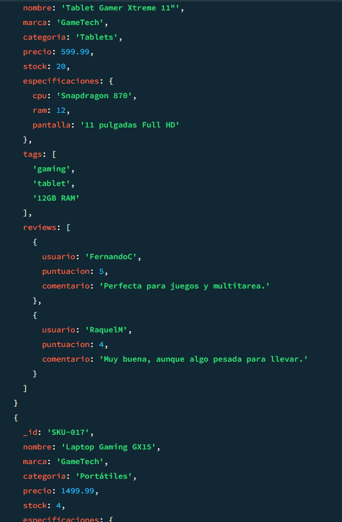
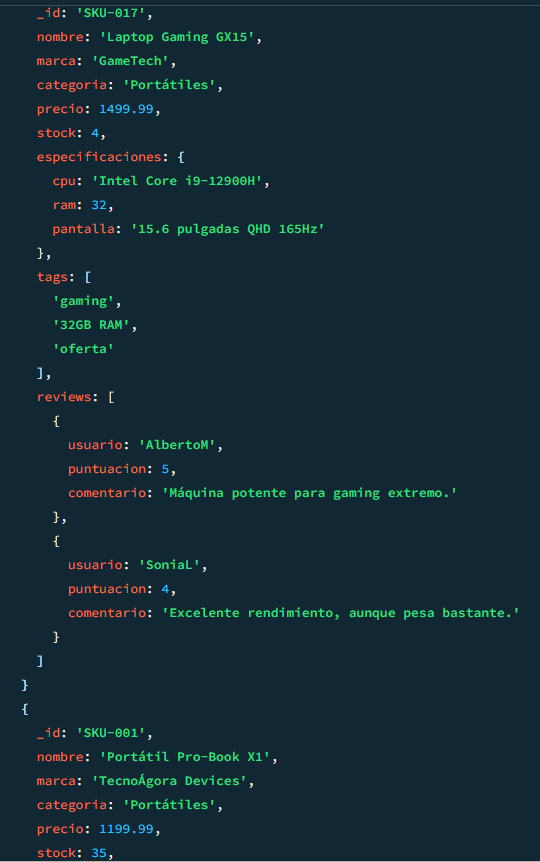
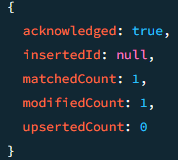
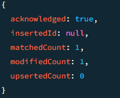
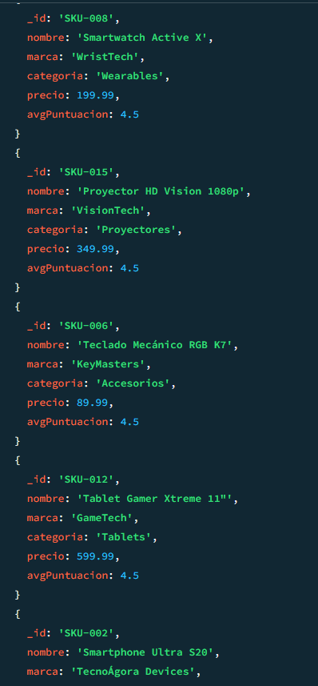
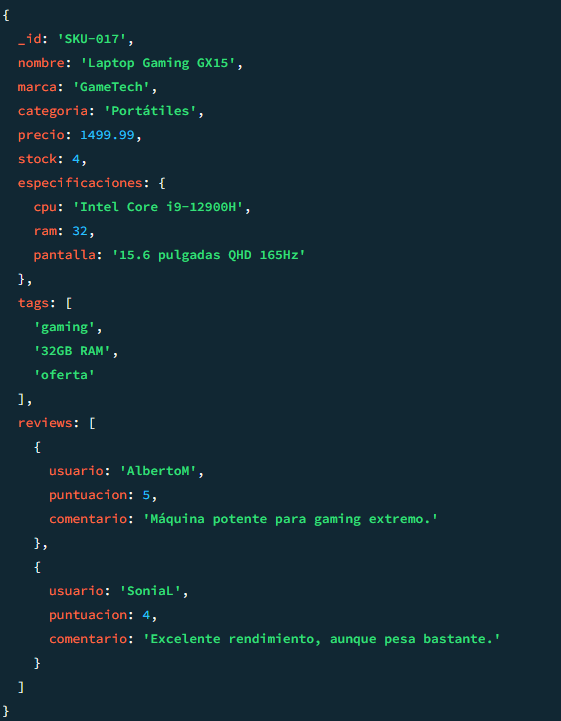
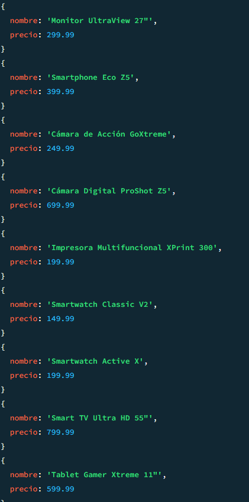
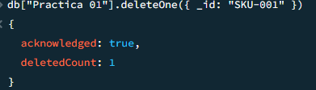

# Parte 2
## Ejercico 1

```
db["Practica 01"].find({"especificaciones.ram": {$gt: 8}}) 
```



## Ejercicio 2

```
db["Practica 01"].find({tags: {$in: ["oferta"]}}) 
```



## Ejercicio 3

```
db["Practica 01"].updateOne({ nombre: "Portátil Pro-Book X1" },{ $inc: { stock: 10 } })
```


## Ejercicio 4

```
db["Practica 01"].updateOne({nombre: 'Portátil Pro-Book X1'},{$push:{reviews: {usuario: 'jdiezl02',
      puntuacion: 1,
      comentario: 'No vale un duro'}}})
```


# Parte 3

```
db["Practica 01"].aggregate([{ $unwind: "$reviews" },
{
      $group: {
      _id: "$_id",
      nombre: { $first: "$nombre" },
      marca: { $first: "$marca" },
      categoria: { $first: "$categoria" },
      precio: { $first: "$precio" },
      avgPuntuacion: { $avg: "$reviews.puntuacion" }
      }
  },{ $sort: { avgPuntuacion: -1 } }
])
```


# Parte 4

## Ej 1

```
db["Practica 01"].find({"stock": {$lt: 5}})
```



## Ej 2

```
db["Practica 01"].find({},{nombre: 1, _id: 0,precio: 1})
```



## Ej 3

```
deleteOne({ _id: "SKU-001" })
```
