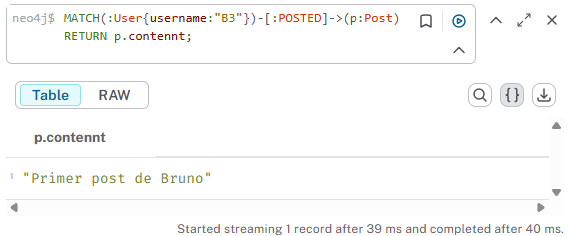

# Neo4j y Modelado de Redes Sociales
# Ejercico 1

```
CREATE(:User{username:"J1", name:"Joaquin", registration_date:"23/10/2025"});

CREATE(:User{username:"A2", name:"Ana", registration_date:"22/10/2025"});

CREATE(:User{username:"B3", name:"Bruno", registration_date:"20/10/2025"});

CREATE(:User{username:"C4", name:"Carla", registration_date:"19/10/2025"});

```

```
CREATE(:Post{contennt:"J1", timestamp:"23:13 23/10/2025"});

CREATE(:Post{contennt:"Publicación de Ana", timestamp:"21:45 22/10/2025"});

CREATE(:Post{contennt:"Primer post de Bruno", timestamp:"09:30 20/10/2025"});

CREATE(:Post{contennt:"Carla compartió una foto", timestamp:"14:20 19/10/2025"});

```

```
CREATE(:User{name:"Carla",username:"C4",registration_date:"19/10/2025"})-[:FOLLOWS]->(:User {name:"Bruno",username:"B3",registration_date:"19/10/2025"});

CREATE(:User{name:"Joaquin",username:"J1",registration_date:"23/10/2025"})-[:FOLLOWS]->(:User{name:"Ana",username:"A2",registration_date:"22/10/2025"});

CREATE(:User{name:"Ana",username:"A2",registration_date:"22/10/2025"})-[:FOLLOWS]->(:User{name:"Carla",username:"C4",registration_date:"19/10/2025"});

CREATE(:User{name:"Bruno",username:"B3",registration_date:"20/10/2025"})-[:FOLLOWS]->(:User{name:"Joaquin",username:"J1",registration_date:"23/10/2025"});

```

```
CREATE(:User{name:"Carla",username:"C4",registration_date:"19/10/2025"})-[:POSTED]->(:Post {contennt:"Primer post de Bruno",timestamp:"09:30 20/10/2025"});

CREATE(:User{name:"Joaquin",username:"J1",registration_date:"23/10/2025"})-[:POSTED]->(:Post{contennt:"J1",timestamp:"23:13 23/10/2025"});

CREATE(:User{name:"Ana",username:"A2",registration_date:"22/10/2025"})-[:POSTED]->(:Post{contennt:"Publicación de Ana",timestamp:"21:45 22/10/2025"});

CREATE(:User{name:"Bruno",username:"B3",registration_date:"20/10/2025"})-[:POSTED]->(:Post{contennt:"Primer post de Bruno",timestamp:"09:30 20/10/2025"});

```

```
CREATE(:User{name:"Carla",username:"C4",registration_date:"19/10/2025"})-[:LIKES]->(:Post {contennt:"Primer post de Bruno",timestamp:"09:30 20/10/2025"});

CREATE(:User{name:"Carla",username:"C4",registration_date:"19/10/2025"})-[:LIKES]->(:Post{contennt:"Primer post de Bruno",timestamp:"09:30 20/10/2025"});

CREATE(:User{name:"Joaquin",username:"J1",registration_date:"23/10/2025"})-[:LIKES]->(:Post{contennt:"Publicación de Ana",timestamp:"21:45 22/10/2025"});

CREATE(:User{name:"Ana",username:"A2",registration_date:"22/10/2025"})-[:LIKES]->(:Post{contennt:"Carla compartió una foto",timestamp:"14:20 19/10/2025"});

```


# Ejercicio 2

```
CREATE(:User{username:"D5", name:"Diego", registration_date:"18/10/2025"});

CREATE(:User{username:"E6", name:"Elena", registration_date:"17/10/2025"});

CREATE(:User{username:"F7", name:"Florencia", registration_date:"16/10/2025"});

```

```
CREATE(:User{name:"Diego",username:"D5",registration_date:"18/10/2025"})-[:FOLLOWS]->(:User{name:"Elena",username:"E6",registration_date:"17/10/2025"});

CREATE(:User{name:"Elena",username:"E6",registration_date:"17/10/2025"})-[:FOLLOWS]->(:User{name:"Florencia",username:"F7",registration_date:"16/10/2025"});

CREATE(:User{name:"Florencia",username:"F7",registration_date:"16/10/2025"})-[:FOLLOWS]->(:User{name:"Diego",username:"D5",registration_date:"18/10/2025"});

```

```
CREATE(:User{name:"Diego",username:"D5",registration_date:"18/10/2025"})-[:POSTED]->(:Post{contennt:"Hola, soy Diego",timestamp:"10:10 18/10/2025"});

CREATE(:User{name:"Elena",username:"E6",registration_date:"17/10/2025"})-[:POSTED]->(:Post{contennt:"Nuevo día, nueva energía - Elena",timestamp:"08:25 17/10/2025"});

CREATE(:User{name:"Florencia",username:"F7",registration_date:"16/10/2025"})-[:POSTED]->(:Post{contennt:"Florencia subió una historia",timestamp:"19:50 16/10/2025"});

```

```
CREATE(:User{name:"Diego",username:"D5",registration_date:"18/10/2025"})-[:LIKES]->(:Post{contennt:"Publicación de Ana",timestamp:"21:45 22/10/2025"});

CREATE(:User{name:"Elena",username:"E6",registration_date:"17/10/2025"})-[:LIKES]->(:Post{contennt:"J1",timestamp:"23:13 23/10/2025"});

CREATE(:User{name:"Florencia",username:"F7",registration_date:"16/10/2025"})-[:LIKES]->(:Post{contennt:"Carla compartió una foto",timestamp:"14:20 19/10/2025"});
```


# Ejercicio 3

```
MATCH (:User{username: "J1"})-[:FOLLOWS]->(u:User) RETURN *;
```


```
MATCH (follower:User)-[:FOLLOWS]->(target:User {username:"J1"})
RETURN *;
```


# Ejercicio 4

```
MATCH(:User{username:"B3"})-[:POSTED]->(p:Post) RETURN p.contennt;
```



```
MATCH(:User{username:"A2"})-[:LIKES]->(p:Post) RETURN p.contennt,p.timestamp;
```


# Ejercicio 5

```
MATCH (p:Post) RETURN p;
```


