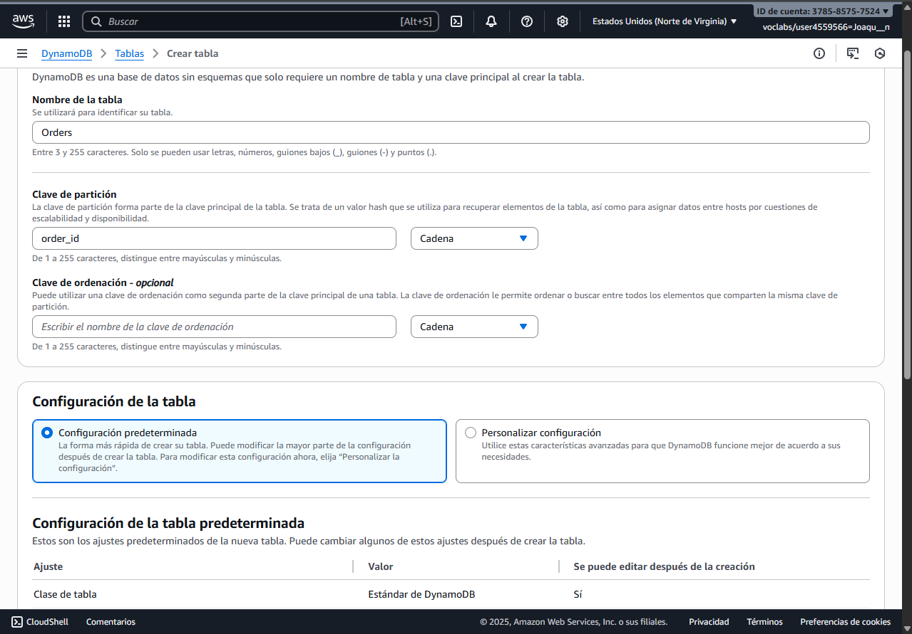
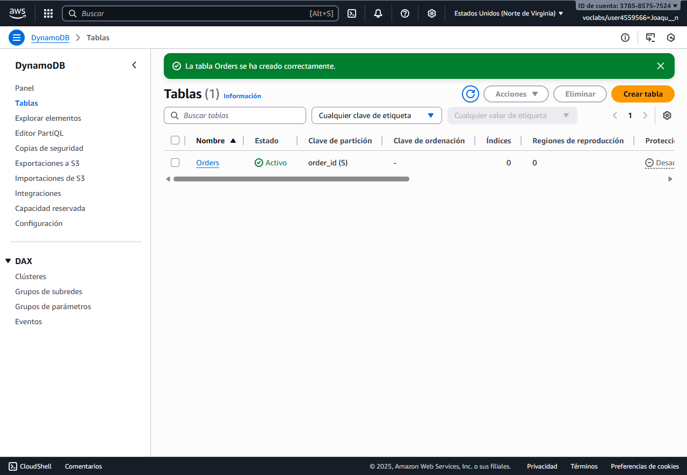
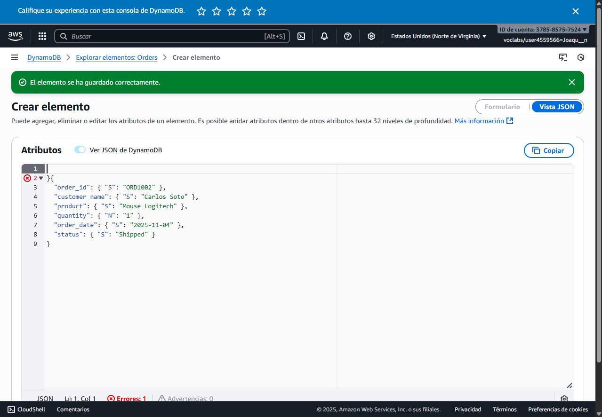
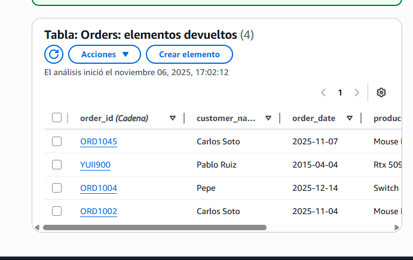
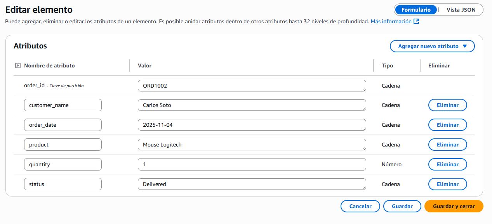
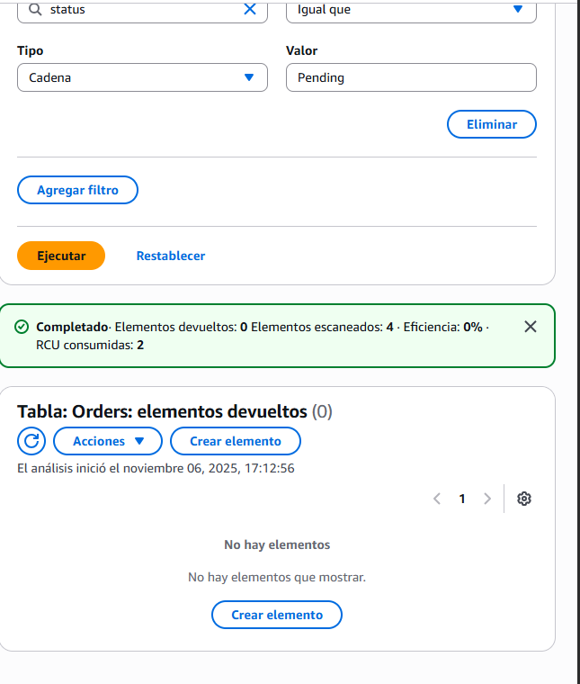
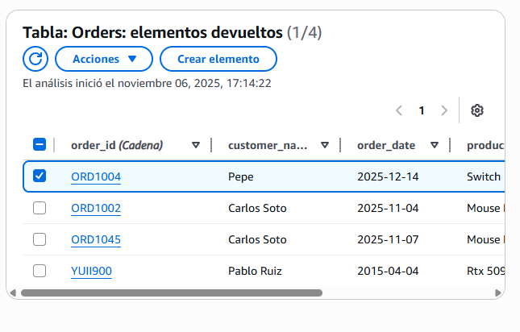
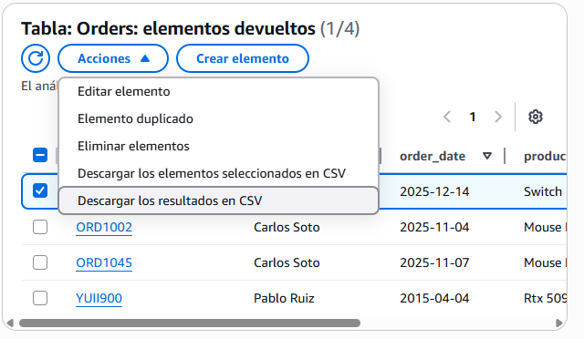
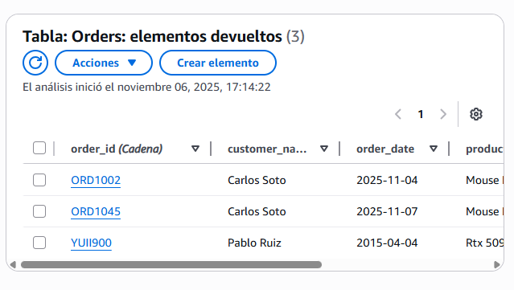

# DynamoDB y el Poder de las Bases de Datos Serverless

# Ejercico 1
```
He echo una tabla en crear tabla.
Luego se crea la tabla.

```




# Ejercico 2
```
Vamos a explorar elementos y creamos un elemento en el apartado JSON.Con esta estructura:
{
  "order_id": { "S": "ORD1002" },
  "customer_name": { "S": "Carlos Soto" },
  "product": { "S": "Mouse Logitech" },
  "quantity": { "N": "1" },
  "order_date": { "S": "2025-11-04" },
  "status": { "S": "Shipped" }
}

```



# Ejercico 3
```
Te vas a filtrar y pones lo que quieres.
```


```
Ahora voy a buscar uno pending y lo actualizo.
```




# Ejercico 4
```
Ahora borro un elemento.
```




# Reflexion Final
## 1
```
DynamoDB es más estructurado y depende mucho de las claves primarias, mientras que MongoDB es más flexible y usa sintaxis tipo JSON para insertar y consultar datos.
```
## 2
```
DynamoDB al ser serverless no requiere gestionar servidores, escala automáticamente y solo pagas por lo que usas; pero sus consultas son más limitadas y puede ser complicado cambiar el modelo después.
```
## 3
```
Lo más fácil fue insertar y leer datos desde la consola o con el SDK, y lo más difícil fue entender el diseño de las claves y cómo hacer consultas eficientes.
```