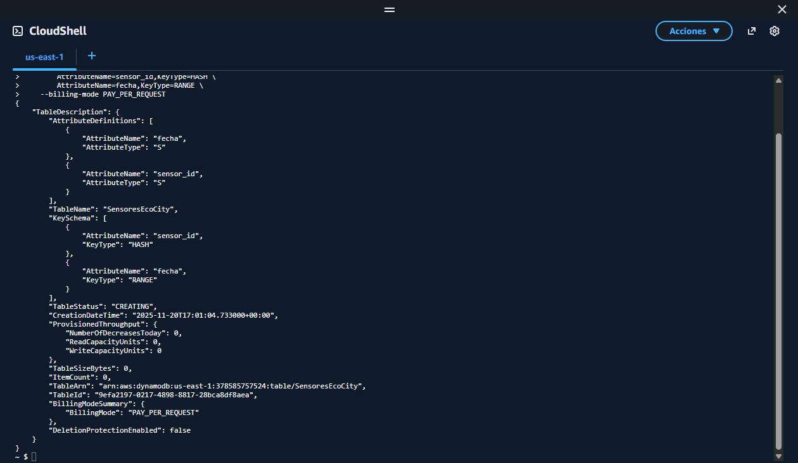
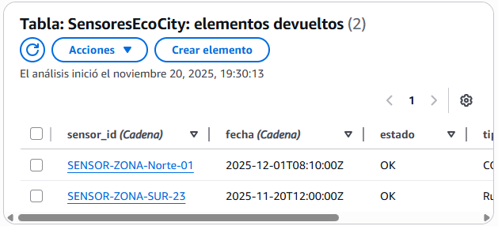
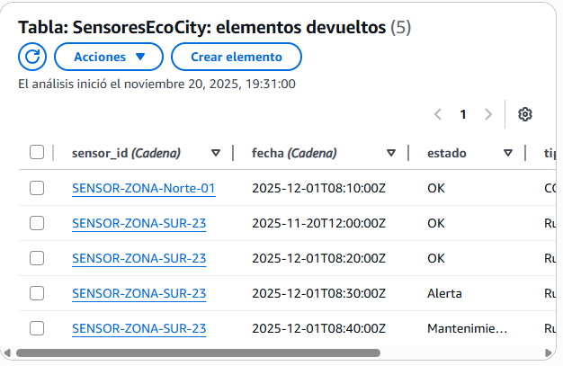
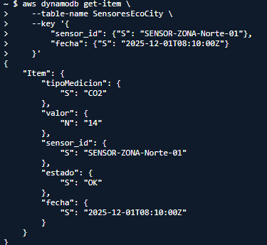
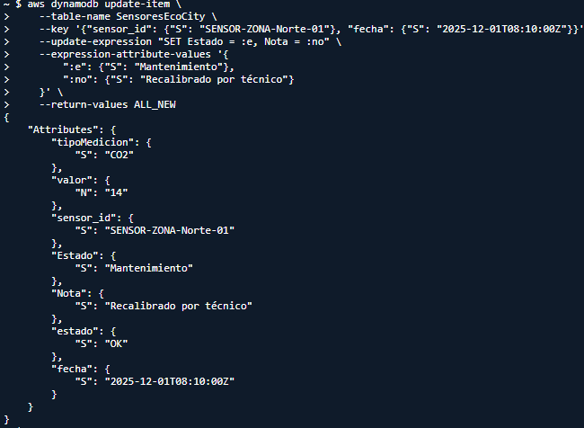
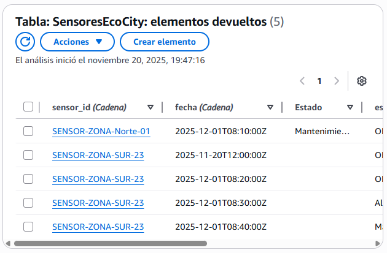
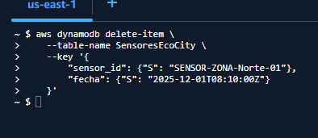
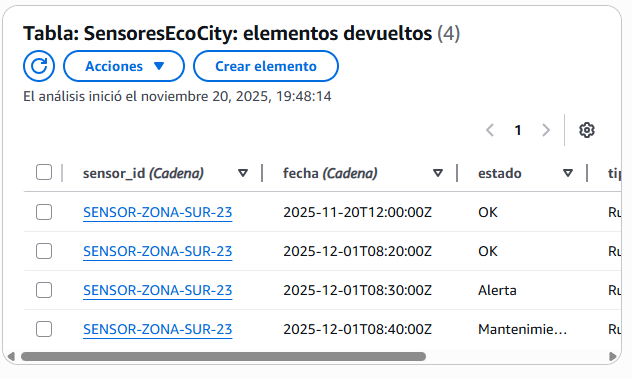

# Operaciones CRUD en DynamoDB

# Descripción


>Hacer una practica de crear,diseññar,consultar,editar y elimnar elementos de una base de datos creada por nosotros mismos.

# 1. Diseño y Creación de la Tabla

```bash
aws dynamodb create-table \
    --table-name SensoresEcoCity \
    --attribute-definitions \
        AttributeName=sensor_id,AttributeType=S \
        AttributeName=fecha,AttributeType=S \
    --key-schema \
        AttributeName=sensor_id,KeyType=HASH \
        AttributeName=fecha,KeyType=RANGE \
    --billing-mode PAY_PER_REQUEST
```


# 2. Ingesta de Datos

Dos sensores diferentes:
```bash
aws dynamodb put-item \
    --table-name SensoresEcoCity \
    --item '{
        "sensor_id": {"S": "SENSOR-ZONA-SUR-23"},
        "fecha": {"S": "2025-11-20T12:00:00Z"},
        "tipoMedicion": {"S": "Ruido"},
        "valor": {"N": "30"},
        "estado": {"S": "OK"}
      }'
```
```bash
aws dynamodb put-item \
  --table-name SensoresEcoCity \
  --item '{
      "sensor_id": {"S": "SENSOR-ZONA-Norte-01"},
      "fecha": {"S": "2025-12-01T08:10:00Z"},
      "tipoMedicion": {"S": "CO2"},
      "valor": {"N": "14"},
      "estado": {"S": "OK"}
  }'
```


Tres sensores con valores distintos:
```bash
aws dynamodb put-item \
  --table-name SensoresEcoCity \
  --item '{
      "sensor_id": {"S": "SENSOR-ZONA-SUR-23"},
      "fecha": {"S": "2025-12-01T08:20:00Z"},
      "tipoMedicion": {"S": "Ruido"},
      "valor": {"N": "18"},
      "estado": {"S": "OK"}
  }'

```
```bash
aws dynamodb put-item \
  --table-name SensoresEcoCity \
  --item '{
      "sensor_id": {"S": "SENSOR-ZONA-SUR-23"},
      "fecha": {"S": "2025-12-01T08:30:00Z"},
      "tipoMedicion": {"S": "Ruido"},
      "valor": {"N": "22"},
      "estado": {"S": "Alerta"}
  }'

```
```bash
aws dynamodb put-item \
  --table-name SensoresEcoCity \
  --item '{
      "sensor_id": {"S": "SENSOR-ZONA-SUR-23"},
      "fecha": {"S": "2025-12-01T08:40:00Z"},
      "tipoMedicion": {"S": "Ruido"},
      "valor": {"N": "19"},
      "estado": {"S": "Mantenimiento"}
  }'

```


# 3. Consulta de Datos

```bash
aws dynamodb get-item \
    --table-name SensoresEcoCity \
    --key '{
        "sensor_id": {"S": "SENSOR-ZONA-Norte-01"},
        "fecha": {"S": "2025-12-01T08:10:00Z"}
    }'
```


# 4. Actualización de Datos

```bash
aws dynamodb update-item \
    --table-name SensoresEcoCity \
    --key '{"sensor_id": {"S": "SENSOR-ZONA-Norte-01"}, "fecha": {"S": "2025-12-01T08:10:00Z"}}' \
    --update-expression "SET Estado = :e, Nota = :no" \
    --expression-attribute-values '{
        ":e": {"S": "Mantenimiento"},
        ":no": {"S": "Recalibrado por técnico"}
    }' \
    --return-values ALL_NEW
```
Antes:

Despues:


# 5. Eliminación de Datos

```bash
aws dynamodb delete-item \
    --table-name SensoresEcoCity \
    --key '{
        "sensor_id": {"S": "SENSOR-ZONA-Norte-01"},
        "fecha": {"S": "2025-12-01T08:10:00Z"}
    }'
```

Lo ejecutamos:

Se ha eliminado:


# 6. Reto Avanzado: Alertas Globales

### 1.No, solo te trae uno tendria que usar scanner.

### 2.Lo que se puede hacer es un indice de Estado y entonces seria la clave estado y asi si funcionaria.

### 3.Tendriamos que hecer un indice:
| Tabla / Índice     | Partition Key | Sort Key | Atributos proyectados              |
|-------------------|---------------|----------|-----------------------------------|
| Tabla principal    | sensor_id     | fecha    | Estado, valor, Nota, tipoMedicion |
| GSI: EstadoIndex   | Estado        | fecha    | sensor_id, valor, Nota, tipoMedicion |

```bash
aws dynamodb query \
    --table-name SensoresEcoCity \
    --index-name EstadoIndex \
    --key-condition-expression "Estado = :a" \
    --expression-attribute-values '{":a":{"S":"Alerta"}}'
```

# Conclusión

>DynamoDB funciona bien para IoT porque es rapido, escala con muchos sensores y permite guardar distintos tipos de datos sin problemas. Ademas, con indices se pueden hacer consultas eficientes, como ver todas las alertas.
