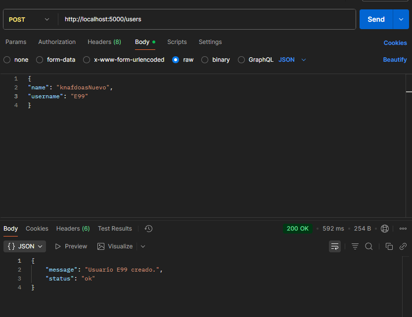
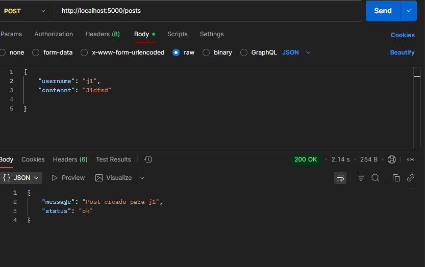
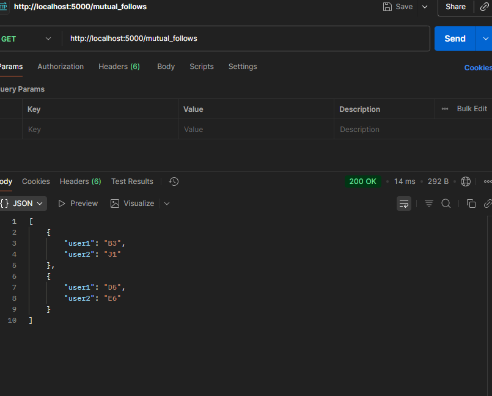

# Posibles Extensiones

Aqui e echo un post que recibe un objeto y crea a un usuario.
```
@app.route("/users", methods=["POST"])
def create_user():
    data = request.get_json()
    username = data.get("username")
    name = data.get("name")
    if not username or not name:
        return jsonify({"error": "username y name son obligatorios"}), 400
    with driver.session() as session:
        session.run("""
            MERGE (u:User {username: $username})
            SET u.name = $name
        """, username=username, name=name)
    return jsonify({"status": "ok", "message": f"Usuario {username} creado."})
```
```
http://localhost:5000/users

```


Aqui e echo un post que recibe un objeto y crea a un post.
```
@app.route("/posts", methods=["POST"])
def create_post():
    data = request.get_json()
    username = data.get("username")
    contennt = data.get("contennt")
    if not username or not contennt:
        return jsonify({"error": "username y content son obligatorios"}), 400
    with driver.session() as session:
        session.run("""
            MATCH (u:User {username: $username})
            CREATE (u)-[:POSTED]->(p:Post {contennt: $contennt, timestamp: datetime()})
        """, username=username, contennt=contennt)
    return jsonify({"status": "ok", "message": f"Post creado para {username}"})
```
```
http://localhost:5000/posts

```


Aqui obtengo los seguidores mutuos.
```
@app.route("/mutual_follows", methods=["GET"])
def mutual_follows():
    with driver.session() as session:
        result = session.run("""
            MATCH (a:User)-[:FOLLOWS]->(b:User),
                  (b)-[:FOLLOWS]->(a)
            WHERE a.username < b.username
            RETURN a.username AS user1, b.username AS user2
            ORDER BY user1, user2
        """)
        mutuals = [record.data() for record in result]
    return jsonify(mutuals)
```
```
http://localhost:5000/mutual_follows

```


Aqui obtengo los seguidores mutuos.
```
@app.route("/mutual_follows", methods=["GET"])
def mutual_follows():
    with driver.session() as session:
        result = session.run("""
            MATCH (a:User)-[:FOLLOWS]->(b:User),
                  (b)-[:FOLLOWS]->(a)
            WHERE a.username < b.username
            RETURN a.username AS user1, b.username AS user2
            ORDER BY user1, user2
        """)
        mutuals = [record.data() for record in result]
    return jsonify(mutuals)
```
```
http://localhost:5000/mutual_follows

```


